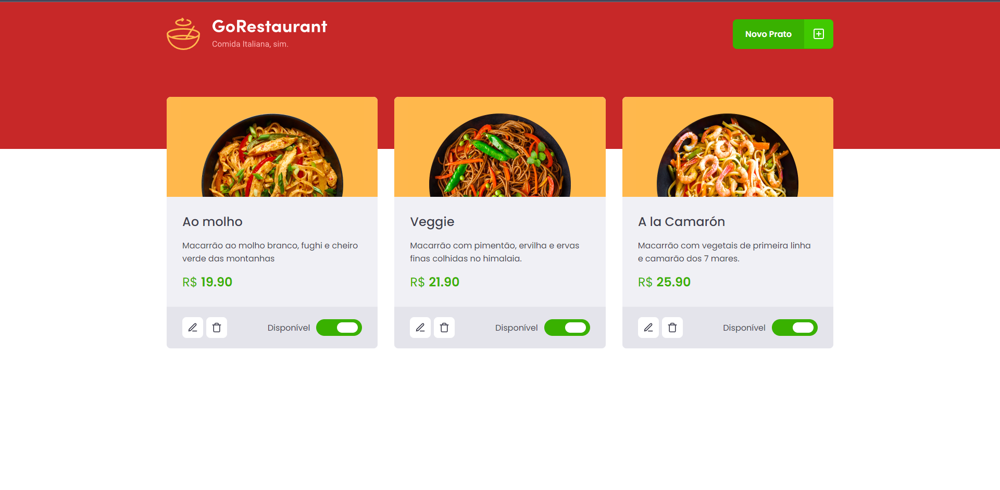

<h1 align="center">
    
</h1>

<br>

## 🍕 Go Restaurant

O Go Restaurant é uma aplicação ficticia, que se trata de uma aplicação para restaurantes controlar quais refeições estão disponíveis e quais estão indisponíveis.


Esta aplicação foi construida, durante o curso IGNITE da RocketSeat.

## 🛠 Tecnologias

Esse projeto foi desenvolvido com as seguintes tecnologias:

- ReactJS
- Typescript
- JSON Server
- Styled-components


## 🚀 Como executar

Clone o projeto e acesse a pasta do mesmo.

```bash
$ git clone git@github.com:luizsmatos/refactoring-classes-ts.git
$ cd refactoring-classes-ts
```

Para iniciá-lo, siga os passos abaixo:
```bash
# Instalar as dependências
$ yarn

# Iniciar o JSON Server
# Iniciar API Fake.
$ yarn server

# Iniciar o projeto
$ yarn start
```

---
